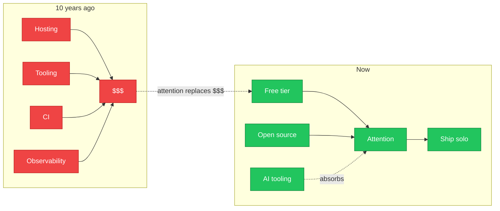

Most engineers have a project they could ship on the side. The thing they'd build if they had the time. Most never ship it. The usual excuse is no time, no co-founder, no team. None of those matter anymore. Free cloud tiers, mature open source platforms, and AI tooling have dropped the cost of starting a software business to near zero. One person with attention and effort can run a real neo enterprise without quitting their day job.

Call them what you want - micro enterprise, side business, solo SaaS, neo enterprise, riffing on neo cloud. Whatever the label, the shape is the same: one person, one product, one customer base, run on the side of a day job.

## The Capital Barrier Is Gone (Attention Replaced It)

Ten years ago, starting a software business meant paying for hosting, paying for tooling, paying for CI, paying for observability. The fixed costs added up. You needed funding or revenue before you had either.

That math is mostly gone. The catch is what replaced it.

Free isn't free. A community tier still needs someone to operate it. Open source still needs someone to learn it, deploy it, support it. Your "free" platform only stays free because other people trade their attention too - users writing docs, contributors answering questions, the community carrying the load you used to pay for. The whole thing runs on someone else's hours.

AI tooling is what makes the trade survivable for a solo operator. Agents scaffold the boilerplate. Agents review the PRs. Agents summarise the support backlog. The same attention budget that would have drowned a solo founder five years ago now ships a product.

The new math:

- **Compute:** community tiers from major clouds. Free, but you operate it.
- **Code:** your time, plus agents for the boring 80% of the scaffolding.
- **Orchestration:** open source CI, queues, schedulers, monitoring. Free, but you learn it.
- **Distribution:** your own domain, your own audience. Free, but you build it.

What used to require a seed round and a co-founder now requires attention, AI leverage, and a long game.

## Backstage Is the Template

*[Backstage](https://backstage.io) project card, Apache 2.0, via [backstage.io](https://backstage.io).*

[Backstage](https://backstage.io) is the cleanest example of the pattern working.

[Spotify](https://engineering.atspotify.com/2020/03/24/introducing-backstage/) built an internal developer portal because they were tired of every team reinventing service catalogues. They [open sourced it](https://github.com/backstage/backstage). It's now a [CNCF incubating project](https://www.cncf.io/projects/backstage/) under Apache 2.0. Anyone can self-host the same portal, with the same plugin ecosystem, the same scaffolder, the same tech radar.

Around that open core, a real neo enterprise has grown:

- Companies that host and operate Backstage for customers who don't want to run it themselves
- Plugin authors shipping paid extensions on top of the free platform
- Training and consulting shops that specialise in adoption
- Managed service providers that package it as a turnkey product for mid-market

None of that needed a giant team. The platform was free. The customers were real. The revenue was real. The whole ecosystem is solo-friendly because the open core did the heavy lifting.

Backstage proved out the customer journey too. Enterprises adopt the free OSS first - it's free, engineers like it, no procurement fight. Then they hit the operational reality. Someone has to run it, upgrade it, wire it into their auth and CI and observability stack, answer the 2am page when the scaffolder breaks. Most enterprises don't want that job. They want the result, not the operations. That's the moment the managed services leg opens up, and that's the moment a neo enterprise gets born. As long as the product is genuinely good. Mediocre OSS doesn't earn the follow-on sale.

The pattern repeats across open source. Mature databases. Observability stacks. CMSes. Workflow engines. Pick one, host it as a service, charge for the operations and the expertise, not the software.

My own [Backstage setup](https://github.com/johnnyhuy/backstage) is the same pattern at solo scale. One person, one internal portal, every project I touch catalogued in one place. Free platform, real value, no co-founder required.

## The Closed Counter-Example

The wave of closed developer tooling [SaaS](https://en.wikipedia.org/wiki/Software_as_a_service) that landed in the last few years tells the other side of the story.

Observability platforms. CI systems. AI code review. Feature flag services. Most of them build on [open source](https://opensource.org/osd) foundations and then sell as closed enterprise products at premium prices. The customer pays. The commons sees very little of it back.

The opportunity is obvious. Be the open alternative.

Run the same platform. Charge a fraction of the price. Contribute improvements upstream. The customers who would rather self-host, who would rather pay for transparent pricing, who would rather not get locked in - they're sitting right there. They've been waiting.

That's not charity. That's a neo enterprise that compounds. Every contribution makes the platform stronger, which makes the business stronger, which makes the next contribution easier.

*[Startup Opportunity](https://xkcd.com/1772/) by Randall Munroe, [CC BY-NC 2.5](https://creativecommons.org/licenses/by-nc/2.5/), via xkcd.*

## What Teams Hide From You

*Team vs solo knowledge after 10 years. Spotify, Adobe and JPMorgan on the team side; Backstage and WordPress on the solo side.*

There's a thing I keep noticing about engineers who've spent years inside large teams. They can write their slice. They can't keep the lights on.

The condensed knowledge of running a project end-to-end - backup, monitoring, billing, support, churn, the boring stuff - gets distributed across people inside big orgs. When the team dissolves, or when you rotate off it, the knowledge goes with it.

Solo work concentrates that knowledge back into one head.

The same engineers who couldn't keep a side project alive in their twenties find they can in their thirties, once they've internalised the operational muscle. Backup that actually restores. Monitoring that pages you before the customer does. A pricing page that doesn't lie. Support replies that close tickets. Churn signals you can read.

The team hid that from them. Solo work surfaces it. There's no version of this learning that happens faster than running the thing yourself, end to end, on a Tuesday night when the deploy breaks.

> [!TIP] The team teaches you how to ship tickets.
> Solo work teaches you how to run a business.

## The Long Game Compounds If You Share

*Exponential growth vs power and linear references over 20 years. Rocket at year 1, dollar sign at year 5, building at year 10, product groupings at year 10 and 20.*

The opportunity cost isn't building. It's not building.

Someone is out there right now building the thing you're sitting on. The question is whether it's you, with your name on it and your history of iterations behind it - or someone else, with their name on it instead.

The long game is simple and slow:

- Build a thing
- Ship it publicly
- Share what you learned, what you got wrong, what you'd do differently
- Recognise the things you over-indexed on and pull back from the rest
- Repeat, with the next thing

Your track record builds itself. Customers find you. Opportunities compound. None of it requires quitting your day job. It requires attention over months, not weeks, and the willingness to ship things that aren't quite ready.

You might as well do it. Someone will be out there doing it anyway.

## Consultants Already Live Here

This isn't new for solo consultants. They've always run neo enterprises on the side:

- Monitoring services for a handful of customers
- Operational support for small teams that don't want a full-time SRE
- Bespoke infrastructure for local businesses that don't have an IT department

What changed is that software products - not just services - are now viable at solo scale.

The same free stack that killed the capital barrier killed the team barrier too. A solo consultant can ship a product alongside the services, and the product compounds while the services pay the bills. The product doesn't need to be SaaS. It can be a hosted open source platform, a paid plugin, a packaged monitoring stack, a turnkey workflow engine.

Different lens: build for yourself, or build for a customer, or both. Same playbook. Same long game. The line between "side project" and "consulting deliverable" is thinner than people think.

---

Your next steps are the ones only you can name.

