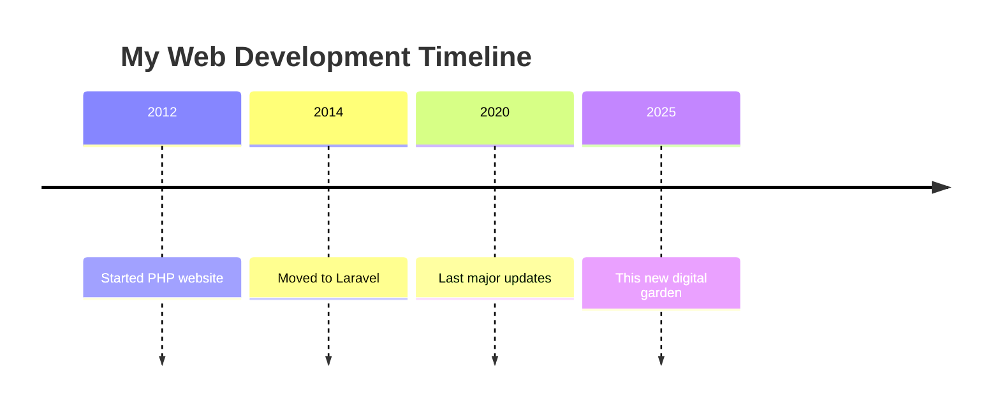

# Reigniting the Flame

I'm building this website after a five-year hiatus. Five years since I released my first template—a simple copy-paste job from GitHub back when Jekyll and GitHub Pages were the standard, before GitHub Actions was even a thing.

Now it's probably time to stretch a muscle that hasn't been used in a while: front-end development.

## The Spark

Back in the day, I built websites here and there. Not many, really. The one that stands out was a Laravel project—a passion project for a Garry's Mod gaming community called the Gentleman's Gaming Society. That site came from a friendship that's now lasted over 12 years (since 2012, if you're doing the math).

Throughout those years until 2020, I kept iterating on it. Started with a simple PHP website from scratch, then graduated to Laravel and learned my way up from there. That spark I had back then? That's what I want to bring back in 2025 and beyond.

## But... Why?

Who am I really writing this for? Why would anyone care that I'm putting this out into the open internet?

Honestly? Probably no one. And that's okay.

I think it's a good time to just put something out there. Maybe someone will find useful bits of information—particularly about my homelab adventures and solutions I've white-knuckled my way through. Instead of writing docs that sit forgotten in some private repository, I can share them here.

This digital garden will remain ad-free. I don't expect anyone to care about what's inside, but if you happen to like this stuff, that's a nice bonus. Consider it an extension of my GitHub profile, but with more context and personality.

## The Tech Stack

I went fairly hog wild with technology, using what's relevant for 2025—though we all know it'll probably be outdated in five years.

I've tried to keep dependencies minimal. There are websites that have been around for years with barely any changes that still run fine. I'm not building a CMS or a dedicated back-end service just for a static site.

This is all static, running on:
- Tailwind CSS
- Next.js
- TypeScript
- ...and so on

The design? A kitchen sink of patterns I've noticed across multiple portfolio websites, combined into my own particular style. Is it the best design? Probably not. But it's good enough, and it's out there.

## The Process

I built this using all the trendy tools of today, including AI IDEs like WindSurf and Cursor. Essentially "vibe-coding" my way through almost the entire project. Whether that's good or bad might be a topic for another post.

I've got a library of Obsidian notes that will never see public light—they're my brain dump of everything from deep research to YouTube transcripts, often summarized and generated with AI tools. Eventually, I might curate some into more human-readable blog posts here.

I tend to hoard knowledge, but hopefully I can spread it out in something more curated to my writing style.

## Let's Connect

If something here catches your interest, reach out. I'm usually accessible through LinkedIn and Discord (if you try hard enough). I'm busy at times with whatever's on my plate, but I'm happy to keep in touch.

This space will evolve as I share more about my projects, homelab adventures, and the occasional tech rambling. Consider this the beginning of something new—or rather, something old made new again.
