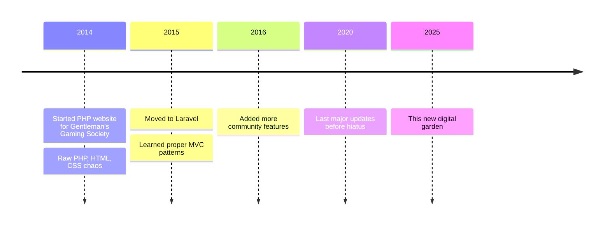

I'm building this website after a five-year hiatus. Five years since I released my first template—a simple copy-paste job from GitHub back when Jekyll and GitHub Pages were the standard, before GitHub Actions was even a thing. It's wild to think how much has changed in the web development landscape since then. Frameworks have come and gone, entire paradigms have shifted, and here I am, trying to make sense of it all again.

Now it's probably time for me to stretch a muscle that hasn't been used in a while: front-end development. That part of my brain that deals with layouts, responsive design, and making things look pretty has been dormant for too long. I used to have opinions on CSS frameworks and JavaScript libraries, but lately? I've been too busy with other aspects of tech to keep up. This website is my re-entry vehicle.

## The Spark That Started It All

Back in the day, I built websites here and there. Not many, really—I wasn't some prolific web developer churning out sites every weekend. The one that really stands out was a Laravel project—a passion project for a Garry's Mod gaming community called the [Gentleman's Gaming Society](https://ggs.sx). That site came from a friendship that's now lasted over 12 years (since 2014, if you're doing the math), which is pretty incredible when you think about it. A digital connection that outlasted most of my real-world ones.

Check out the Wayback Machine archives of the site:

- [2016](https://web.archive.org/web/20160307181605/https://ggs.sx/)
- [2017](https://web.archive.org/web/20170707175450/https://ggs.sx/)
- [2018](https://web.archive.org/web/20180104044936/https://ggs.sx/)
- [2022](https://web.archive.org/web/20221003141634/https://ggs.sx/)
- [2024](https://web.archive.org/web/20240530122807/https://ggs.sx/)

> [!NOTE]
> These archives reflect a gaming community from the early-mid 2010s. Like many gaming spaces of that era, it contained content and language that was typical of what was essentially a digital playground for teens and young adults. Some of the humor and terminology used back then may not align with today's standards.

Note that this was before the days of Discord where we used forums like this site and TeamSpeak to communicate. 

Throughout those years until 2021 - 2022, I kept iterating on it. Started with a simple PHP website from scratch—you know, the kind where you're mixing HTML and PHP tags in the same file like some kind of chaotic soup. Then I gradually graduated to Laravel and learned my way up from there. Models, views, controllers, database migrations—the whole MVC shebang. 

That spark I had back then? That feeling when a layout finally renders correctly or when a complex feature works exactly as intended? That's what I want to bring back in 2025 and beyond. It's like rediscovering an old hobby and realizing you still get the same joy from it.

## But... Why Am I Doing This?

Who am I really writing this for? Why would anyone care that I'm putting this out into the open internet? These are questions I've asked myself repeatedly as I built this site. 

Honestly? Probably no one. And that's completely okay.

I think it's a good time to just put something out there in the open. Maybe someone will stumble across this site while looking for a solution to a problem they're having. Maybe they'll find useful bits of information—particularly about my homelab adventures and solutions I've white-knuckled my way through. 

Instead of writing docs that sit forgotten in some private repository, I can share them here where they might actually help someone. We're in this era where everyone's trying to monetize their knowledge, slap ads on everything, or build a personal brand. I'm not interested in any of that. 

This digital garden will remain ad-free and ego-free. I don't expect anyone to care about what's inside, but if you happen to like this stuff, that's a nice bonus. Consider it an extension of my GitHub profile, but with more context and personality—a place where code meets thoughts.

## The Tech Stack (Or How I Went Down the Rabbit Hole)

I went fairly hog wild with technology for this site, using what's relevant for 2025—though we all know it'll probably be outdated in five years. That's just how web development works, isn't it? The framework you swear by today becomes tomorrow's legacy system.

I've tried to keep dependencies minimal, though. There are websites that have been around for years with barely any changes that still run fine. I'm not building a CMS or a dedicated back-end service just for a static site. That would be overkill, and frankly, I don't want to maintain it.

This is all static, running on:
- Tailwind CSS for styling (because writing raw CSS in 2025 feels masochistic)
- Next.js as the framework (with its server and client components that I'm still wrapping my head around)
- TypeScript for type safety (because debugging JS type errors at 2 AM is no longer how I want to spend my time)
- MDX for content (so I can embed components in markdown, which feels like magic)
- Deployed on... well, that's a story for another post

The design? A kitchen sink of patterns I've noticed across multiple portfolio websites, combined into my own particular style. I've borrowed ideas from dozens of personal sites I admire, mixing and matching until I had something that felt like "me." Is it the best design in the world? Absolutely not. But it's good enough, and it's out there. Done is better than perfect, especially for a personal project like this.

## The Process (Or: How I Vibe-Coded a Website)

I built this using all the trendy tools of today, including AI IDEs like WindSurf and Cursor. I've been essentially "vibe-coding" my way through almost the entire project—letting the tools suggest patterns and implementations while I focus on the overall direction. 

There's a certain joy in letting the AI handle the boilerplate while you focus on the interesting problems. It's like pair programming with a partner who never gets tired or annoyed when you ask the same question for the fifth time. But there's also something lost when you're not crafting every line by hand. The intimacy with the codebase changes. The ownership feels different.

Whether that's good or bad might be a topic for another post. I have plenty of thoughts on the role of AI in creative coding, but I'm still sorting through them. For now, I'll just say that it's been an interesting experiment, and I'm learning as much about the tools as I am about myself as a developer.

## The Digital Hoarding Problem

I've got a library of just obsidian notes that will never see the light of day in the public space. Just due to the fact that I use obsidian notes as somewhat of a transactional database or at least brain dump of everything I slurp up from deep research tools or just generally YouTube transcripts and stuff like that and getting AI tools to summarize and generate notes into that space.

I tend to hoard information. I collect articles, videos, tutorials, and documentation like some people collect stamps or vintage records. The problem is, all that knowledge sits locked away where no one else can benefit from it. 

Hopefully eventually I can curate some of those notes into blog posts that people can read here. That's a bit more human readable rather than something that I can just read and gather knowledge from. It's sort of my neck that I do like to just hoard a lot of knowledge but hopefully I can probably spread that out a bit and propagate that in something that's a bit more curated into my particular writing style.

## The Homelab Chronicles

A significant chunk of what I'll be writing about here will involve my homelab setup. Over the years, I've built a modest home server infrastructure running various services—from media servers to home automation to networking experiments.

Much of this was learned through trial and error, late nights Googling obscure error messages, and the occasional "oh no" moment when something critical went down. I've documented most of it, but those docs are scattered across private repositories, note-taking apps, and sometimes just in my head.

Consolidating and sharing that knowledge here seems worthwhile. If I spent three hours figuring out why a particular Docker container kept crashing only to discover it was a simple environment variable issue, maybe I can save someone else those three hours.

I'm particularly looking forward to sharing some of my adventures in self-hosting, network configuration, and the joys (and pains) of managing your own infrastructure. There's something deeply satisfying about running your own services, even if it sometimes feels like more trouble than it's worth.

## Let's Connect

If you do have something interesting in mind, please do reach out. I'm usually accessible through [LinkedIn](https://www.linkedin.com/in/johnnyhuy/) and other means like Discord if you try hard enough. I am busy at times with a good mix of whatever I have on my plate at the moment, but I'd be happy to keep in touch.

This space will evolve as I share more about my projects, homelab adventures, and the occasional tech rambling. Consider this the beginning of something new—or rather, something old made new again. A return to building and sharing in the open, without the pressure of metrics or monetization.

Thanks for reading this far. If you're still here, you're either really bored or we might have similar interests. Either way, welcome to my little corner of the internet.

Let's see where this goes 🙏
