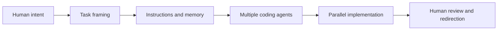
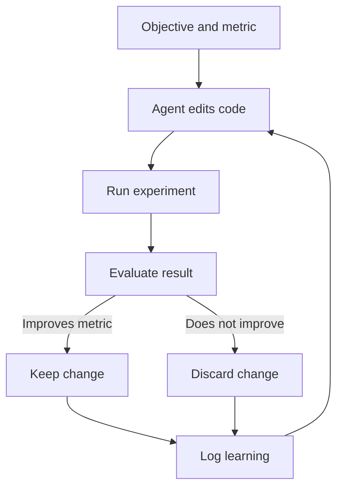

"Code's not even the right verb anymore. I have to express my will to my agents for most of the day."

That's Andrej Karpathy describing his workflow from around December 2025. Sounds extreme until you've spent a week running multiple agent sessions in parallel, each on a different chunk of work, while you review and redirect.

The deeper idea: the most valuable pattern isn't one helpful model. It's autonomous systems that keep working while you're not watching.

The shift from single-session to orchestration is gradual then sudden. You start with one agent walking through features line by line. Eventually you have multiple sessions running: one researching documentation, one implementing a feature, one writing tests. You bounce between them like a conductor, except the musicians keep playing when you look away.

Leave an agent running overnight on a refactoring task and come back to find completed work, passed tests, edge cases handled, and a detailed summary of changes. Not perfect — some optimisations unnecessarily complex — but done overnight what would have taken a full day. The feeling is simultaneously exhilarating and slightly disorienting. You're no longer the one doing the work. You're the one directing it.

## Agentic Engineering Is Now Orchestration

Karpathy describes a sharp shift where manual coding fell away and agent delegation became default. The skill isn't writing every line anymore. It's expressing intent clearly, splitting work into macro actions, and managing multiple agents across repos and tools.

The limiting factor is increasingly you, not compute access. Mastery looks like running multiple agents in parallel — one on research, one on planning, one on implementation.

Token throughput is the new GPU utilisation. More leverage means more anxiety — unused model capacity feels like wasted opportunity. Review is still the bottleneck. A big diff still needs human eyes.

Karpathy says many agent failures are skill issues in instructions, memory, or decomposition rather than model limits. "Everything is skill issue," as he puts it.

## Persistent Loops: The Next Frontier

Karpathy distinguishes ordinary agent sessions from "claw" systems — persistent loops that keep running in their own sandbox, accumulating memory, acting while you're away.

AutoResearch applies this to AI research: agents modify training code, run experiments, keep only improvements.

Remove the human from the inner loop when the objective and metric are explicit. AutoResearch surprised Karpathy by finding useful optimisations in an already well-tuned repo.

Use autonomous loops where metrics are clean, verification is cheap, and risk is bounded. Keep the editable surface small. Treat agent instructions as first-class artefacts — iterate, version, benchmark them.

Persistent loops work where the objective and metric are explicit. A test suite with a clear goal — reduce runtime without decreasing coverage — and an unambiguous metric — total seconds — is ideal. The loop modifies setup code, runs a subset, measures time, keeps improvements.

Over a weekend, it might find optimisations you wouldn't have considered: parallelising test data setup, replacing database fixtures with in-memory mocks, subtle changes to state cleanup between runs. The total improvement might be 30-40% faster tests. Review each change on Monday morning. Some straightforward merges. Some requiring adjustment because the loop optimised for the metric in ways that harm readability.

This is where persistent loops get interesting. Not for replacing human judgement, but for exploring the solution space while humans sleep. The loop generates hypotheses. The human validates and refines. The combination is more powerful than either alone.

## Model Progress Is Jagged

Frontier models aren't improving evenly. They're getting dramatically better at verifiable things like coding and optimisation. Staying weirdly static at humour, nuance, and knowing when to ask clarifying questions.

| Theme | Karpathy's Point | What It Means |
|-------|-----------------|-------------|
| Verifiable tasks | RL works great with objective rewards | Coding and optimisation race ahead |
| Soft tasks | Non-verifiable domains improve less reliably | Nuance and humour stay uneven |
| Jaggedness | Brilliant PhD and ten-year-old at once | Human supervision stays necessary |
| Speciation | Smaller specialised models should emerge | Task fit may beat one giant model |
| Fine-tuning limits | Weight-level steering is still immature | Context windows do most customisation |

Labs still chase one general model because they serve unknown demand. Speciation makes sense where the task is narrow, valuable, and benefits from lower latency or cost.

## Jobs and Open Source: New Power Balances

Karpathy sees AI's labour impact as restructuring digitally mediated work, not simple replacement.

| Area | Main Claim | Strategic Takeaway |
|------|------------|-------------------|
| Digital jobs | Information manipulation changes first | Learn to use AI, don't avoid it |
| Software demand | Lower cost can increase demand (Jevons effect) | Engineering may expand before it contracts |
| Frontier labs | Employees get edge access, lose some independence | Impact exists inside and outside labs |
| Open source | Open models stay slightly behind but matter structurally | Healthy ecosystems need a shared base |
| Centralisation risk | Too few frontier actors is risky | More labs and open capability improve balance |

Software demand might rise as creation gets cheaper. People outside frontier labs retain more freedom to speak and experiment.

## Robotics Lags, Education Gets Agentified

Digital work transforms faster than robotics because bits are easier to copy and test than atoms.

On education: explanatory work increasingly routes through agents. Humans contribute the irreducible insights, curriculum shape, and conceptual compression.

Build for agent consumption as well as human consumption — docs, APIs, teaching materials. Focus human effort on the insight agents can't discover themselves.

## Summary

- **Agentic engineering is orchestration, not typing.** Express intent, split work, manage parallel loops.
- **Persistent autonomy is next.** Loops that keep running while you sleep.
- **Model progress is jagged.** Coding races ahead. Nuance stays flat. Expect speciation.
- **Software demand may rise, not fall.** Cheaper creation can expand the market.
- **Build for agents too.** Docs, APIs, teaching materials should be agent-readable.

## What's Next

"The name of the game is how can you get more agents running for longer periods of time without your involvement."

Start with one persistent loop in a domain you know well. Measure the output. Iterate the instructions. That's the new skill.
