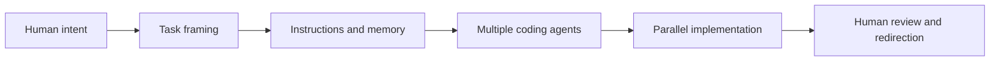
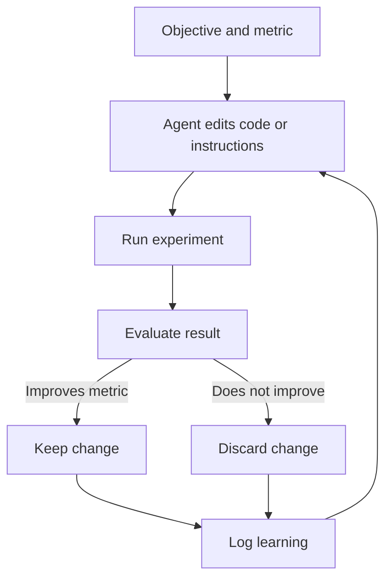

Code's not even the right verb anymore. I have to express my will to my agents for most of the day.

That is [Andrej Karpathy](https://karpathy.ai/)'s description of his own workflow shift beginning around December 2025. It sounds extreme until you've spent a week running multiple agent sessions in parallel, each handling a discrete chunk of work, while you review and redirect.

The deeper thesis is that the most valuable pattern is no longer a single helpful model, but autonomous systems that can keep working without a human in the loop. That idea shows up in coding agents, home automation, AutoResearch, distributed experiment swarms, and even a new model of education where humans contribute the sparse conceptual breakthroughs and agents handle explanation, iteration, and execution.

## Agentic Software Engineering Becomes Orchestration

Karpathy describes a sharp personal workflow shift where manual coding fell away and agent delegation became the default. The relevant skill is no longer writing every line, but expressing intent clearly, splitting work into macro actions, and managing multiple agents across different repos and tools.

The limiting factor is increasingly the operator rather than raw compute access. Mastery looks like running multiple agents in parallel, each handling an isolated macro task such as research, planning, or implementation.

Token throughput now plays the psychological role that GPU utilisation once played in research settings. Increased leverage also increases operator anxiety because unused model capacity feels like wasted opportunity. Review remains the hard boundary because a large diff can still bottleneck on human verification.

Karpathy frames many agent failures as a skill issue in instructions, memory, or decomposition rather than a hard model ceiling. Everything is skill issue, as he puts it.

## Claws and AutoResearch Push Toward Persistent Loops

Karpathy distinguishes ordinary agent sessions from more persistent claw-like systems that keep looping in their own sandbox, accumulate memory, and keep acting while the human is away.

[AutoResearch](https://github.com/karpathy/autoresearch) applies this pattern to AI research by letting agents modify training code, run experiments, and retain only improvements.

The core design move is to remove the human from the inner loop when the objective and metric are explicit. AutoResearch surprised Karpathy by finding useful hyperparameter and optimisation changes in an already well-tuned repo. `program.md` is treated as research-organisation code, meaning the instructions themselves become an optimisation surface.

Use autonomous loops first in domains with clean metrics, cheap verification, and bounded risk. Keep the editable surface area small so diffs remain understandable and evaluation remains comparable. Treat agent instructions as first-class artefacts that deserve iteration, versioning, and benchmarking.

## Model Progress Is Real but Jagged

Frontier models are not improving uniformly. They are becoming dramatically better in verifiable domains such as coding and optimisation, while staying oddly static in softer areas such as humour, nuance, and when to ask clarifying questions. That leads to an expectation of eventual model speciation rather than one perfectly general monoculture.

| Theme | Karpathy's Point | Implication |
|-------|-----------------|-------------|
| Verifiable tasks | RL strongly improves domains with objective rewards | Coding and optimisation race ahead |
| Soft tasks | Non-verifiable domains improve less reliably | Nuance, humour, and intent-reading stay uneven |
| Jaggedness | Models can feel like a brilliant PhD and a ten-year-old at once | Human supervision stays necessary |
| Speciation | Smaller specialised models should emerge over time | Efficiency and task fit may beat one giant model |
| Fine-tuning limits | Weight-level steering remains immature | Context windows still do most of the customisation work |

Current labs still pursue a monoculture model strategy because they serve unknown user demand across many tasks. Speciation becomes more likely where the task is narrow, valuable, and benefits from lower latency or lower cost. Context windows are currently a much safer and cheaper control surface than deep weight manipulation.

## Jobs, Research and Open Source Shift Toward New Power Balances

Karpathy treats AI's labour impact as a restructuring of digitally mediated work rather than a simple replacement story. Software demand may rise because software becomes cheaper to produce, while autonomous research loops may compress the need for humans in the inner loop of frontier labs.

| Area | Main Claim | Strategic Takeaway |
|------|------------|-------------------|
| Digital jobs | Work that manipulates digital information changes first | Learn to use AI as a tool rather than avoid it |
| Software demand | Lower cost can increase demand through Jevons-style effects | Engineering may expand before it contracts |
| Frontier labs | Employees gain access to the edge but lose some independence | Impact exists both inside and outside labs |
| Open source | Open models remain slightly behind but structurally important | Healthy ecosystems need a shared common layer |
| Centralisation risk | Too few frontier actors creates systemic risk | More labs and more open capability improve balance |

Jobs are bundles of tasks, and AI currently works best as an amplifier across parts of those bundles. Karpathy is cautiously optimistic that software demand rises as software creation becomes radically cheaper. Independent ecosystem work can matter because people outside frontier labs retain more freedom to speak and experiment.

## Robotics Lags Digital Systems While Education Gets Agentified

Karpathy expects digital work to transform faster than robotics because bits are easier to copy, test, and optimise than atoms. The near-term bridge is the interface layer where sensors feed real-world data into models and actuators or humans carry instructions back into the world.

On education, he argues that explanatory work will increasingly be routed through agents, with humans contributing the irreducible insights, curriculum shape, and conceptual compression behind things like [microgpt](https://karpathy.github.io/2026/02/12/microgpt/).

Build for agent consumption as well as human consumption, especially in docs, APIs, and teaching materials. Focus human effort on the irreducible insight or simplification that agents cannot yet discover for themselves.

## Summary

- **Agentic engineering is orchestration, not typing.** The skill is expressing intent, splitting work, and managing parallel loops.
- **Persistent autonomy is the next frontier.** AutoResearch-style loops that keep running while you sleep.
- **Model progress is jagged, not uniform.** Coding races ahead. Nuance stays flat. Expect speciation.
- **Software demand may rise, not fall.** Jevons-style effects mean cheaper creation can expand the market.
- **Build for agents as well as humans.** Docs, APIs, and teaching materials should be agent-readable.

## What's Next

The name of the game is how can you get more agents running for longer periods of time without your involvement, doing stuff on your behalf. Start with one persistent loop in a domain you understand well. Measure the output. Iterate the instructions. That's the new skill.
